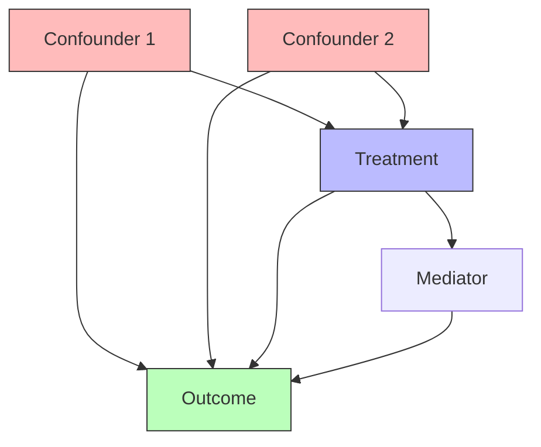

The backdoor criterion identifies sufficient sets of variables for controlling confounding when estimating causal effects. A set Z satisfies the backdoor criterion relative to ordered pair (X,Y) if it blocks all backdoor paths from X to Y and contains no descendants of X.

A backdoor path is any path from X to Y that contains an arrow entering X. These paths represent spurious association through common causes rather than causal flow from X to Y. Blocking all backdoor paths removes confounding bias, isolating the true causal effect.



When set Z satisfies the backdoor criterion, the causal effect equals the adjusted association: P(Y|do(X=x)) = Σ_z P(Y|X=x,Z=z)P(Z=z). This adjustment formula allows computing interventional probabilities from observational data by conditioning on Z.

```python
def estimate_causal_effect(data, treatment, outcome, adjustment_set):
    """Estimate causal effect using backdoor adjustment."""
    effect = 0
    for z in adjustment_set.unique_values():
        # Stratify by confounder values
        stratum = data[adjustment_set == z]
        # Compute conditional effect
        p_y_tx_z = stratum[outcome].mean()
        # Weight by confounder distribution
        p_z = len(stratum) / len(data)
        effect += p_y_tx_z * p_z
    return effect
```

The backdoor criterion provides a graphical test for confounding control that is both necessary and sufficient under causal assumptions encoded in the graph. Multiple adjustment sets may satisfy the criterion, with some being more efficient or robust than others.
