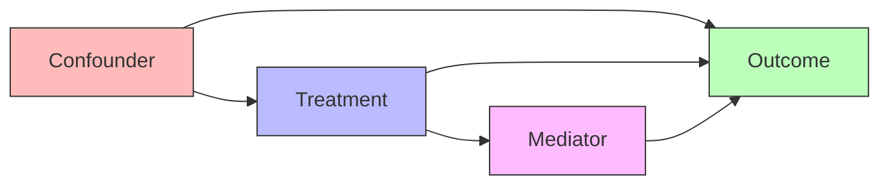

A causal graph is a directed acyclic graph where edges represent direct causal relationships between variables. Unlike correlation networks that show statistical associations, causal graphs encode the actual data-generating process.

Each directed edge X → Y in a causal graph means that X is a direct cause of Y: changing X through intervention would change Y, holding all other direct causes constant. Absence of an edge indicates no direct causal effect, though indirect effects through other variables may still exist.

Three fundamental path structures appear in causal graphs. A chain X → M → Y represents mediation, where X affects Y through mediator M. A fork X ← Z → Y indicates confounding, where common cause Z creates spurious association. A collider X → Z ← Y shows selection bias potential, where conditioning on Z opens a path between X and Y.

Causal graphs enable key inferential tasks: identifying confounders that must be controlled, determining minimal sufficient adjustment sets for unbiased effect estimation, and planning experimental interventions. The [[Backdoor Criterion]] and [[d-separation]] provide graphical tools for these tasks.
