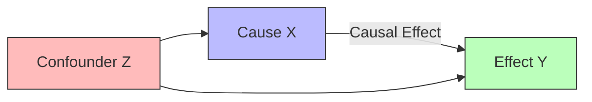

---
tags:
- fundamental-concept
type: concept
parent: '[[Philosophy of Science]]'
wikidata: Q1137724
ancestor_of:
- '[[Instrumental Variables]]'
- '[[Inverse probability weigthing]]'
- '[[Mediation Analysis]]'
- '[[Policy Evaluation]]'
- '[[Propensity Score Matching]]'
- '[[Root Cause Analysis]]'
inferred_by: reasoner
---
Causality (Wikidata: Q1137724) describes the relationship between causes and effects. In David Hume's classical formulation, causation involves constant conjunction, temporal priority, and necessary connection between events.

Modern causal inference distinguishes correlation from causation through the principle that "correlation does not imply causation." Two variables may be correlated because one causes the other, because they share a common cause (confounding), or simply by chance.

The counterfactual theory of causation, formalized by David Lewis and extended by Judea Pearl, defines causation through potential outcomes: X caused Y if Y would not have occurred without X. This "but-for" test provides a rigorous foundation for causal reasoning.

Three major frameworks formalize causality: Pearl's [[Structural Causal Model]] using graphs and do-calculus, Rubin's [[Rubin Causal Model]] using potential outcomes, and [[Granger Causality]] for time-series data. While these approaches differ in formalism, they are ultimately complementary and can be unified under certain conditions.
