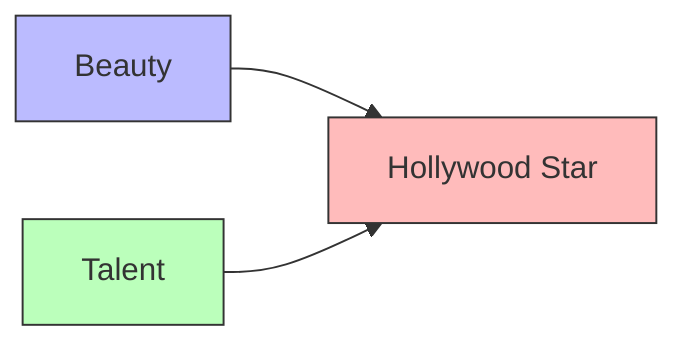

A collider is a variable caused by two or more other variables, forming an inverted fork: X → M ← Y. Unlike confounders, colliders block paths in causal graphs and must not be conditioned upon when estimating causal effects.

Conditioning on a collider opens a spurious path between its causes, creating selection bias or collider-stratification bias. This counterintuitive phenomenon, sometimes called Berkson's paradox, shows how controlling for a variable can introduce rather than remove bias.



Berkson's paradox provides a classic example. Among Hollywood stars (collider), beauty and talent appear negatively correlated: beautiful stars seem less talented, and talented stars seem less beautiful. This spurious negative correlation emerges from conditioning on stardom, even though beauty and talent are uncorrelated in the general population.

```python
# Simulating collider bias
import numpy as np

def simulate_collider_bias(n=1000):
    # Generate independent causes
    beauty = np.random.normal(0, 1, n)
    talent = np.random.normal(0, 1, n)

    # Collider: star if beauty OR talent is high
    star = (beauty > 0.5) | (talent > 0.5)

    # No correlation in full population
    print(f"Correlation (all): {np.corrcoef(beauty, talent)[0,1]:.3f}")

    # Negative correlation when conditioning on collider!
    mask = star
    print(f"Correlation (stars): {np.corrcoef(beauty[mask], talent[mask])[0,1]:.3f}")
```

Selection bias through colliders occurs when sample selection depends on a collider. Clinical settings exhibit this pattern: hospitalization (collider) depends on both disease severity and healthcare-seeking behavior, making hospital samples unrepresentative. Case-control studies face collider bias when controls are selected based on characteristics related to exposure and outcome.

The critical rule: never condition on colliders when estimating causal effects. Unlike [[Confounder]] variables that must be controlled, colliders must be left alone. Graphical methods like [[d-separation]] identify colliders through their distinctive X → M ← Y structure.
