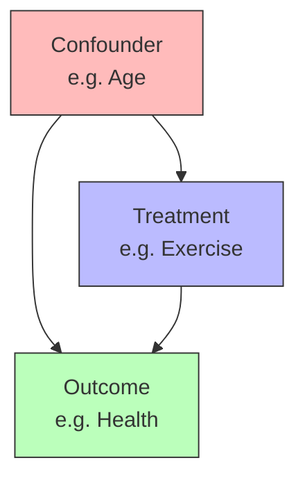

A confounder is a variable that influences both treatment and outcome, creating a spurious association between them. Without controlling for confounders, observed associations confound causal effects with bias from common causes.

The confounding structure forms a fork in the causal graph: Z → X and Z → Y. This creates a backdoor path X ← Z → Y that must be blocked to isolate the direct causal effect X → Y. Failing to account for Z leads to omitted variable bias in effect estimates.



Consider estimating exercise effects on health. Age influences both exercise behavior (younger people exercise more) and health (younger people are healthier). The observed association between exercise and health confounds the true causal effect with spurious association through age.

```python
# Example: Confounding bias
def naive_estimate(data):
    # Ignores confounding - biased!
    treated = data[data['exercise'] == 1]['health'].mean()
    control = data[data['exercise'] == 0]['health'].mean()
    return treated - control

def adjusted_estimate(data):
    # Controls for age - unbiased under assumptions
    effect = 0
    for age in data['age'].unique():
        stratum = data[data['age'] == age]
        treated = stratum[stratum['exercise'] == 1]['health'].mean()
        control = stratum[stratum['exercise'] == 0]['health'].mean()
        weight = len(stratum) / len(data)
        effect += (treated - control) * weight
    return effect
```

Methods for handling confounding include randomization (eliminates confounding by design), adjustment (conditioning on measured confounders via [[Backdoor Criterion]]), [[Instrumental Variables]] (using instruments unrelated to confounders), and [[Propensity Score Matching]] (balancing on confounders).

Observed confounders can be measured and controlled. Unobserved confounders represent unmeasured variables affecting both treatment and outcome, posing a fundamental challenge. Sensitivity analysis assesses how strong unmeasured confounding would need to be to change conclusions.
