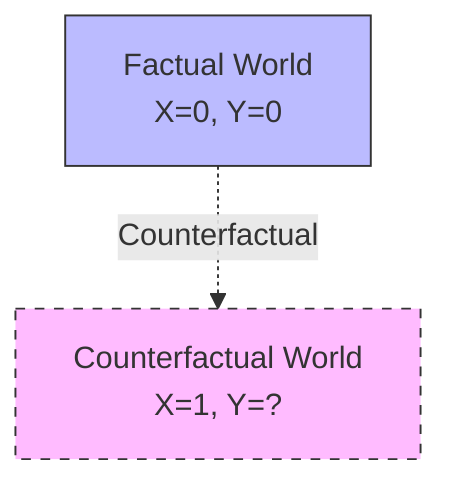

---
parent:
- '[[Structural Causal Model]]'
- '[[Causal inference]]'
tags:
- reasoning
- what-if
type: concept
wikidata: Q5229125
used_by:
- '[[Fairness in Machine Learning]]'
- '[[Root Cause Analysis]]'
inferred_by: reasoner
---
Counterfactuals (Wikidata: Q5229125) express statements about what would have happened under different circumstances. The notation Y_x or Y(x) represents "the value Y would have taken, had X been x" even when X was actually something else.

Judea Pearl's ladder of causation distinguishes three levels of reasoning. Level 1 (association) involves passive observation: P(Y|X) asks what we expect given what we see. Level 2 (intervention) involves active manipulation: P(Y|do(X)) asks what would happen if we act. Level 3 (counterfactual) involves retrospective reasoning: P(Y_x|X',Y') asks what would have happened if things had been different.

```python
class CounterfactualReasoning:
    def __init__(self, scm):
        self.scm = scm

    def counterfactual(self, X, x, evidence):
        """Compute counterfactual Y_x given evidence."""
        # Step 1: Abduction - infer exogenous variables from evidence
        U = self.scm.infer_U(evidence)
        # Step 2: Action - set X to x (intervention)
        modified_scm = self.scm.intervene(X, x)
        # Step 3: Prediction - compute Y under modified model
        Y_x = modified_scm.predict(U)
        return Y_x
```

Counterfactuals enable individual-level causal reasoning. While interventional queries P(Y|do(X)) give population-level effects, counterfactuals answer "what if" questions about specific individuals: "Would this patient have survived if given treatment?"



Applications include fairness assessment (would an individual's outcome differ with different protected attributes?), explanation (why did this outcome occur?), legal reasoning (but-for causation in tort law), and regret analysis (should I have acted differently?). The three-step process of abduction-action-prediction enables computing counterfactuals from structural causal models.
