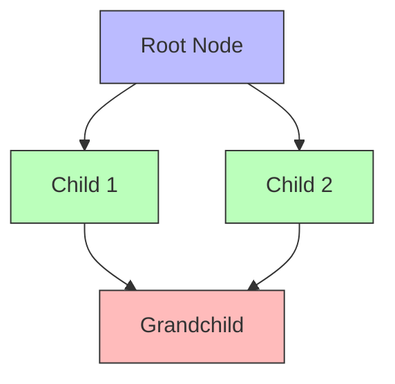

A Directed Acyclic Graph (DAG, Wikidata: Q842346) is a graph structure with directed edges that contains no cycles. In graph theory, this means you cannot start at any vertex and follow the directed edges to return to that same vertex.

DAGs have the useful property of topological ordering: vertices can be linearly ordered such that for every directed edge from vertex A to vertex B, A comes before B in the ordering. This property makes DAGs particularly suitable for representing causal relationships, where causes must precede their effects.

In causal modeling, nodes represent variables while directed edges represent direct causal effects. The acyclic constraint prevents logical paradoxes where A causes B and B causes A, ensuring a well-defined temporal and causal ordering.

Key concepts include paths (sequences of edges), ancestors (nodes with directed paths leading to a vertex), descendants (nodes reachable from a vertex), and parents (direct predecessors). These relationships form the foundation for graphical tests of conditional independence like [[d-separation]].
