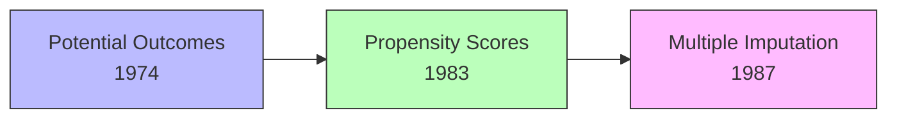

---
tags:
- researcher
- statistics
type: person
wikidata: Q92760
field:
- '[[Statistics]]'
- '[[Causal Inference]]'
known_for:
- '[[Rubin Causal Model]]'
- '[[Propensity Score Matching]]'
contributed_to: '[[Propensity Score Matching]]'
inferred_by: reasoner
---
Donald Rubin (Wikidata: Q92760) developed the potential outcomes framework for causal inference, now called the Rubin Causal Model. His work established rigorous statistical methods for estimating treatment effects from observational data and designing randomized experiments.

The potential outcomes framework represents causality through hypothetical outcomes under different treatments. Each unit has potential outcomes Y(1) under treatment and Y(0) under control. The individual causal effect is Y(1) - Y(0), but we observe only one outcome—the fundamental problem of causal inference identified by Holland and Rubin in 1986.

```python
# Potential outcomes framework
class Unit:
    def __init__(self):
        self.Y_0 = None  # Potential outcome under control
        self.Y_1 = None  # Potential outcome under treatment
        self.treatment = None  # Actual treatment received

    def observed_outcome(self):
        # We only see one potential outcome
        return self.Y_1 if self.treatment == 1 else self.Y_0

    def causal_effect(self):
        # The quantity we want but cannot observe!
        return self.Y_1 - self.Y_0
```

Rubin introduced [[Propensity Score Matching]] with Paul Rosenbaum in 1983, showing that conditioning on the propensity score e(X) = P(T=1|X) balances covariates between treatment groups. This dimension-reduction result made matching feasible even with many confounders.



The Rubin Causal Model emphasizes assumptions required for causal inference: SUTVA (Stable Unit Treatment Value Assumption), ignorability or unconfoundedness, and overlap or common support. Making assumptions explicit allows assessing their plausibility and sensitivity.

While Pearl's [[Structural Causal Model]] and Rubin's potential outcomes framework appear different, they are mathematically equivalent under certain conditions. Pearl emphasizes graphs and mechanisms, while Rubin emphasizes potential outcomes and design. Both perspectives contribute essential insights to modern causal inference.
