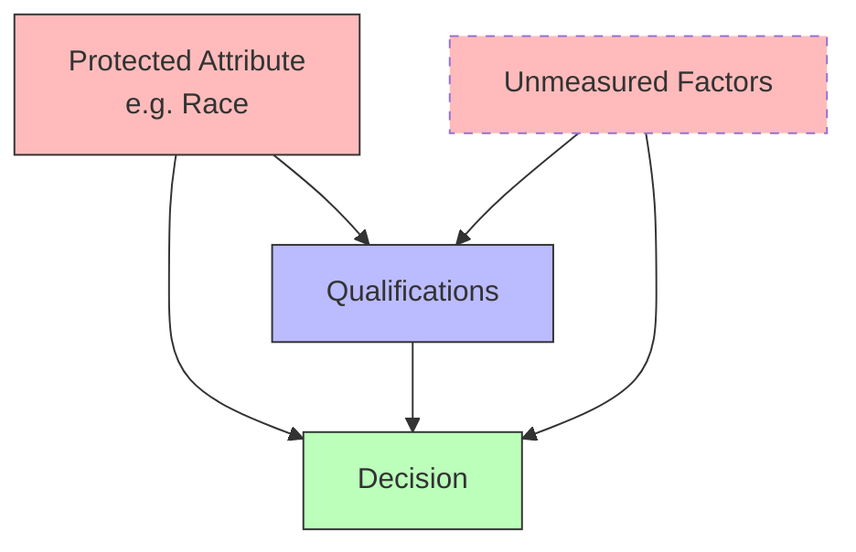

Causal inference provides a principled framework for reasoning about fairness in machine learning systems. Unlike purely statistical fairness criteria, causal fairness distinguishes legitimate from illegitimate influences and enables interventions to promote fairness.

Statistical parity requires equal positive prediction rates across groups: P(Ŷ=1|A=0) = P(Ŷ=1|A=1) where A is a protected attribute. However, this criterion may be inappropriate when groups differ in relevant qualifications. Causal fairness criteria address this by considering the mechanisms generating outcomes.



Counterfactual fairness, introduced by Kusner et al. (2017), requires that a decision remain unchanged in a counterfactual world where an individual had a different protected attribute: Ŷ_A=0 = Ŷ_A=1. This ensures decisions depend only on legitimate factors, not protected attributes or their causal descendants.

```python
def counterfactual_fairness(scm, individual, decision_function):
    """Check if decision is counterfactually fair."""
    # Factual decision with actual protected attribute
    decision_factual = decision_function(individual)

    # Counterfactual: what if protected attribute were different?
    individual_counterfactual = scm.counterfactual(
        protected_attribute=1 - individual.protected_attribute,
        evidence=individual.features
    )
    decision_counterfactual = decision_function(individual_counterfactual)

    # Fair if decision unchanged
    return decision_factual == decision_counterfactual
```

Path-specific fairness blocks causal pathways from protected attributes while allowing others. For instance, we might block direct discrimination (A → Decision) and discrimination through stereotypes but allow pathways through actual qualifications. [[Mediation Analysis]] identifies which pathways transmit effects.

Applications include fair lending, hiring, criminal justice risk assessment, and medical diagnosis. By encoding fairness assumptions in causal graphs and using [[Counterfactual]] reasoning, we can design systems that provably satisfy our fairness objectives.
