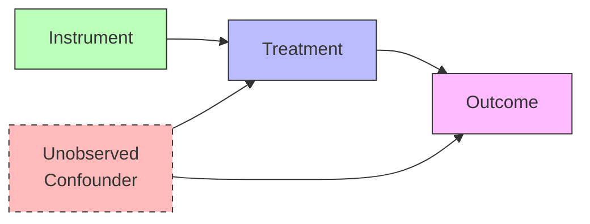

Instrumental variable (IV) methods estimate causal effects in the presence of unobserved confounding. An instrument is a variable Z that affects treatment X but influences outcome Y only through its effect on X, providing an exogenous source of variation in treatment.

Philip Wright introduced instrumental variables in 1928 to estimate supply and demand curves. The method has since become fundamental in econometrics and increasingly important in epidemiology and social science where randomization is infeasible.



Three conditions define a valid instrument. Relevance requires that Z affects X: Cov(Z,X) ≠ 0. Exclusion requires that Z affects Y only through X, with no direct effect. Independence requires that Z is unrelated to confounders U: Z ⊥ U. When these hold, the causal effect equals the ratio: β = Cov(Y,Z) / Cov(X,Z).

```python
def instrumental_variable_estimate(Z, X, Y):
    """Two-stage least squares estimation."""
    # First stage: predict treatment from instrument
    X_hat = fit_linear_model(Z, X)
    # Second stage: regress outcome on predicted treatment
    beta = fit_linear_model(X_hat, Y)
    return beta
```

Common instruments include randomized encouragement (randomly encouraging but not forcing treatment), natural experiments (policy changes affecting treatment), genetic variants (Mendelian randomization), and distance or access measures (affecting treatment receipt but not outcomes directly).
