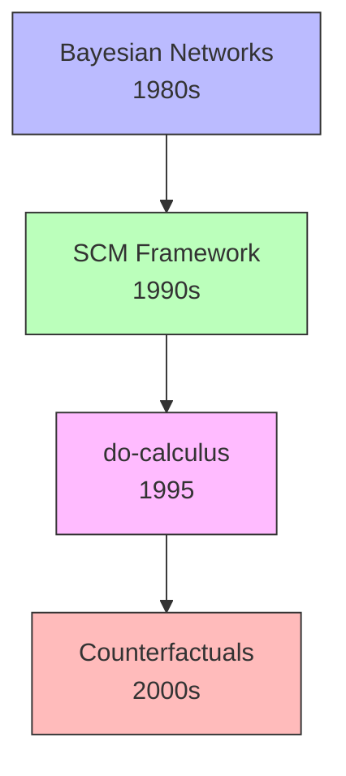

---
tags:
- researcher
- ai
- causality
type: person
wikidata: Q92743
field:
- '[[Artificial Intelligence]]'
- '[[Causal Inference]]'
known_for:
- '[[Structural Causal Model]]'
- '[[do-calculus]]'
theory_applied_by:
- '[[Fairness in Machine Learning]]'
- '[[Inverse probability weigthing]]'
- '[[Mediation Analysis]]'
- '[[Policy Evaluation]]'
- '[[Root Cause Analysis]]'
inferred_by: reasoner
---
Judea Pearl (Wikidata: Q92743) is a computer scientist and philosopher who revolutionized causal inference by introducing graphical models and formal calculi for causal reasoning. He received the Turing Award in 2011 "for fundamental contributions to artificial intelligence through the development of a calculus for probabilistic and causal reasoning."

> "Data are profoundly dumb about causal relationships. No matter how big the data, they cannot tell us whether smoking causes cancer or whether exercise leads to weight loss." — Judea Pearl

Pearl's key insight was recognizing that causality requires a language distinct from probability. While probability describes association (what we observe), causality describes intervention (what would happen if we act). The do-operator, introduced in 1995, provides this language by distinguishing P(Y|X) from P(Y|do(X)).

His major contributions span multiple domains. [[Structural Causal Model]] unifies graphical and equation-based approaches to causality. [[do-calculus]] provides a complete algorithm for identifying causal effects from observational data. [[Bayesian Networks]] enable efficient probabilistic inference. The [[Counterfactual]] framework extends causal reasoning to individual-level "what-if" questions.

Pearl's books "Causality: Models, Reasoning, and Inference" (2000) and "The Book of Why" (2018) established causal inference as a rigorous mathematical discipline while making it accessible to broader audiences. His ladder of causation—from association to intervention to counterfactuals—provides a conceptual framework for understanding different levels of causal reasoning.
