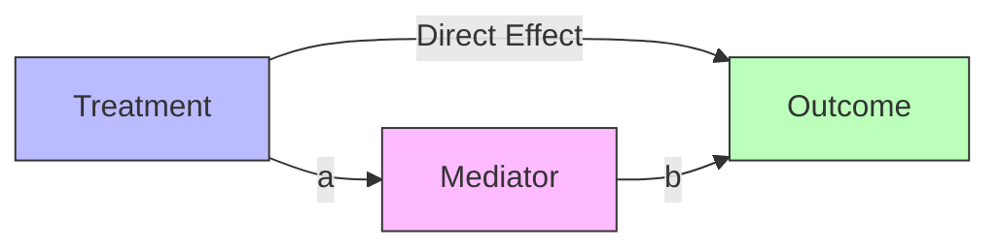

Mediation analysis decomposes causal effects into direct and indirect components, revealing the mechanisms through which causes produce effects. A mediator M lies on the causal pathway from treatment X to outcome Y, transmitting part of X's effect.

The total effect of X on Y can be decomposed as: Total Effect = Direct Effect + Indirect Effect. The direct effect represents X's impact on Y not mediated through M. The indirect effect represents X's impact transmitted through M. This decomposition reveals how much of the causal effect operates through different pathways.



Traditional mediation analysis uses the product method: indirect effect = a × b, where a is the effect of X on M and b is the effect of M on Y controlling for X. However, this approach fails with nonlinear models or treatment-mediator interactions, motivating the causal mediation framework.

```python
def mediation_analysis(data, treatment, mediator, outcome):
    """Decompose total effect into direct and indirect effects."""
    # Total effect: E[Y|do(X=1)] - E[Y|do(X=0)]
    total = estimate_effect(data, treatment, outcome)

    # Natural direct effect: E[Y|do(X=1, M=M_0)] - E[Y|do(X=0, M=M_0)]
    # Natural indirect effect: E[Y|do(X=1, M=M_1)] - E[Y|do(X=1, M=M_0)]

    # Where M_1 = mediator value under X=1, M_0 = mediator value under X=0
    nde = estimate_natural_direct_effect(data, treatment, mediator, outcome)
    nie = total - nde

    return {'total': total, 'direct': nde, 'indirect': nie}
```

Applications include understanding mechanisms in randomized trials, identifying intervention targets, evaluating surrogate endpoints, and assessing discrimination pathways in fairness analysis.
