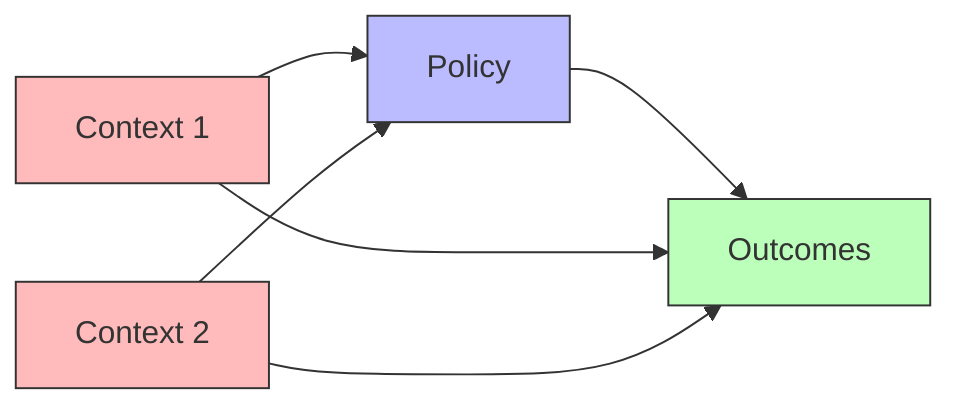

Policy evaluation assesses the causal impact of interventions, programs, or policies. Rigorous evaluation distinguishes true causal effects from spurious associations, informing decisions about whether to continue, expand, or modify policies.

The fundamental question in policy evaluation is counterfactual: what would have happened without the policy? This counterfactual outcome cannot be observed directly—we see outcomes either with or without the policy, never both for the same unit at the same time.



Gold standard approaches include [[Randomized Controlled Trial]] where random assignment eliminates confounding by design. When randomization is infeasible, quasi-experimental methods exploit natural experiments or policy discontinuities. [[Difference-in-Differences]] compares changes over time between treated and control groups. [[Regression Discontinuity]] exploits assignment rules based on threshold crossings. [[Instrumental Variables]] leverage exogenous variation in policy exposure.

```python
def difference_in_differences(data):
    """Estimate policy effect using diff-in-diff."""
    # Treatment group: change from pre to post
    treated_pre = data[(data.treated == 1) & (data.post == 0)].outcome.mean()
    treated_post = data[(data.treated == 1) & (data.post == 1)].outcome.mean()
    treated_change = treated_post - treated_pre

    # Control group: change from pre to post
    control_pre = data[(data.treated == 0) & (data.post == 0)].outcome.mean()
    control_post = data[(data.treated == 0) & (data.post == 1)].outcome.mean()
    control_change = control_post - control_pre

    # Difference-in-differences estimate
    return treated_change - control_change
```

Key challenges include external validity (do effects generalize beyond the study context?), compliance (do people follow the policy as intended?), spillovers (does treatment of some units affect others?), and long-term effects (do short-term gains persist?).

Structural causal models enable richer analysis by modeling mechanisms. Rather than simply estimating average effects, we can identify heterogeneous effects across subgroups, understand why policies work or fail, and predict effects of modified or scaled-up policies.
