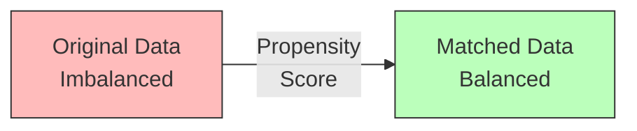

Propensity score matching balances treatment and control groups on observed covariates by matching units with similar probabilities of treatment. Introduced by Paul Rosenbaum and Donald Rubin in 1983, the method reduces bias from observed confounding in observational studies.

The propensity score e(X) = P(T=1|X) is the probability that a unit receives treatment given covariates X. Rosenbaum and Rubin showed that conditioning on the propensity score is equivalent to conditioning on all covariates X when estimating treatment effects under unconfoundedness.

```python
def estimate_propensity_score(X, T):
    """Estimate propensity scores using logistic regression."""
    model = LogisticRegression()
    model.fit(X, T)
    return model.predict_proba(X)[:, 1]

def match_on_propensity(treated, control, propensity_scores, caliper=0.1):
    """Match treated units to controls with similar propensity."""
    matches = []
    for i, t_score in enumerate(propensity_scores[treated]):
        # Find closest control within caliper
        c_scores = propensity_scores[control]
        distances = abs(c_scores - t_score)
        if distances.min() < caliper:
            j = distances.argmin()
            matches.append((i, j))
    return matches
```

Several matching methods exist. Nearest neighbor matching pairs each treated unit with the closest control. Caliper matching imposes a maximum distance threshold. Stratification divides units into propensity score strata. Inverse probability weighting uses propensity scores as weights rather than matching.



Key assumptions include unconfoundedness (no unmeasured confounding), common support (overlap in propensity scores between groups), and correct propensity score specification. Violations lead to biased effect estimates, particularly when extrapolating beyond the region of common support.
