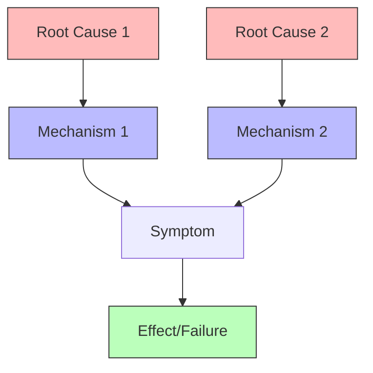

Root cause analysis identifies the fundamental causes of observed effects or failures. Unlike correlation-based diagnostics that identify symptoms, causal analysis traces effects back through causal pathways to find actionable intervention points.

The causal approach builds a [[Structural Causal Model]] of the system, observes the effect or failure, then traces backward through causal paths using [[Counterfactual]] reasoning. A variable is a root cause if changing it would have prevented the effect while holding other causes constant.



Traditional root cause analysis uses the "5 Whys" method: repeatedly ask why an effect occurred until reaching fundamental causes. The causal framework formalizes this intuition through counterfactual queries: "Would the failure have occurred if this factor were different?"

```python
def root_cause_analysis(scm, failure):
    """Identify root causes of observed failure."""
    root_causes = []

    # Test each variable as potential root cause
    for variable in scm.variables:
        # Counterfactual: what if variable took different value?
        for alternative_value in scm.domain(variable):
            counterfactual_outcome = scm.counterfactual(
                intervention={variable: alternative_value},
                evidence=scm.observed_values
            )

            # Root cause if changing it prevents failure
            if counterfactual_outcome != failure:
                root_causes.append((variable, alternative_value))

    return root_causes
```

Applications span diverse domains. System reliability engineering uses causal models to diagnose failures and design fault-tolerant systems. Medical diagnosis identifies disease causes from symptoms, enabling targeted treatment. Quality control traces defects to manufacturing process steps. Incident analysis in aviation and healthcare identifies contributing factors beyond proximate causes.

Causal root cause analysis distinguishes symptoms from causes, identifies multiple contributing factors, prioritizes interventions by leverage, and prevents future failures rather than merely responding to current ones. By encoding system structure explicitly, causal models enable proactive reliability engineering and continuous improvement.
