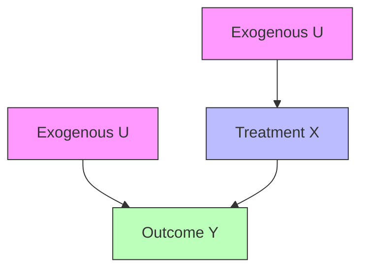

---
tags:
- overview
- causal-inference
type: framework
wikidata: Q7628072
uses:
- '[[Graphical models]]'
indirectly_uses:
- '[[Graph]]'
inferred_by: reasoner
created_by:
- '[[Judea Pearl]]'
used_by:
- '[[Difference-in-Differences]]'
- '[[Directed Acyclic Graph]]'
- '[[Fairness in Machine Learning]]'
- '[[Inverse probability weigthing]]'
- '[[Mediation Analysis]]'
- '[[Policy Evaluation]]'
- '[[Randomized Controlled Trial]]'
- '[[Regression Discontinuity]]'
- '[[Root Cause Analysis]]'
- '[[TabPFN]]'
requires_understanding:
- '[[Graph]]'
has_part:
- '[[Causal Graph]]'
---
A Structural Causal Model (SCM, Wikidata: Q7628072) provides a mathematical framework for representing and reasoning about causality. Developed primarily by Judea Pearl, it unifies graphical models with structural equations to enable rigorous causal inference.

> "The Structural Causal Model provides a formal language for expressing causal assumptions and a calculus for deriving causal conclusions from those assumptions." — Judea Pearl

The framework consists of three main components: a set of endogenous variables V (those determined by the model), exogenous variables U (external factors), and structural equations F that define how each variable is generated from its causes.

```python
# Example SCM structure
class StructuralCausalModel:
    def __init__(self):
        self.U = {}  # Exogenous variables
        self.V = {}  # Endogenous variables
        self.F = {}  # Structural equations

    def intervene(self, variable, value):
        # do-operator: set variable to value
        self.V[variable] = value
        # Remove incoming edges in causal graph
```

The mathematical representation is: **M = (U, V, F)** where F defines each v ∈ V as a function of other variables and noise terms from U.



SCMs enable three levels of causal reasoning:  

- association (observing patterns)
- intervention (predicting effects of actions)
- counterfactuals (reasoning about alternative scenarios).
