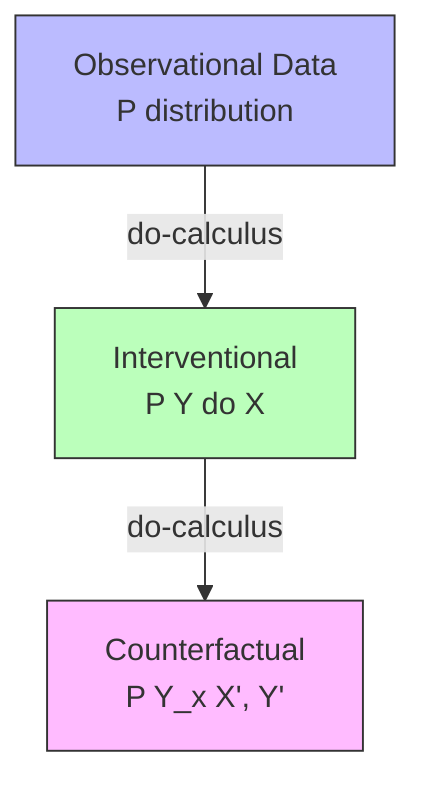

The do-calculus is a set of inference rules for manipulating expressions involving the do-operator, which represents external interventions in causal models. Developed by Judea Pearl in 1995, it provides a complete algorithm for determining whether causal effects can be computed from observational data.

The do-operator distinguishes seeing (observation) from doing (intervention). While P(Y|X=x) represents the conditional probability of Y given that we observe X=x, P(Y|do(X=x)) represents the probability of Y when we externally set X to x, removing all other influences on X.

```python
# Observation vs Intervention
def observe(data, X, x):
    # Passive observation: P(Y|X=x)
    return data[data[X] == x]['Y'].mean()

def intervene(model, X, x):
    # Active intervention: P(Y|do(X=x))
    model.cut_incoming_edges(X)  # Remove other causes
    model.set(X, x)              # Set X externally
    return model.simulate()['Y'].mean()
```

Three rules compose the do-calculus. Rule 1 (insertion/deletion of observations) allows adding or removing observations when they are d-separated. Rule 2 (action/observation exchange) swaps do-operators with observations under certain conditions. Rule 3 (insertion/deletion of actions) removes do-operators when variables are independent of interventions.



The do-calculus is complete for causal inference: if a causal effect can be computed from a given graph and observational data, the do-calculus provides a sequence of rules to derive it. When no such derivation exists, the effect is not identifiable without additional assumptions.
